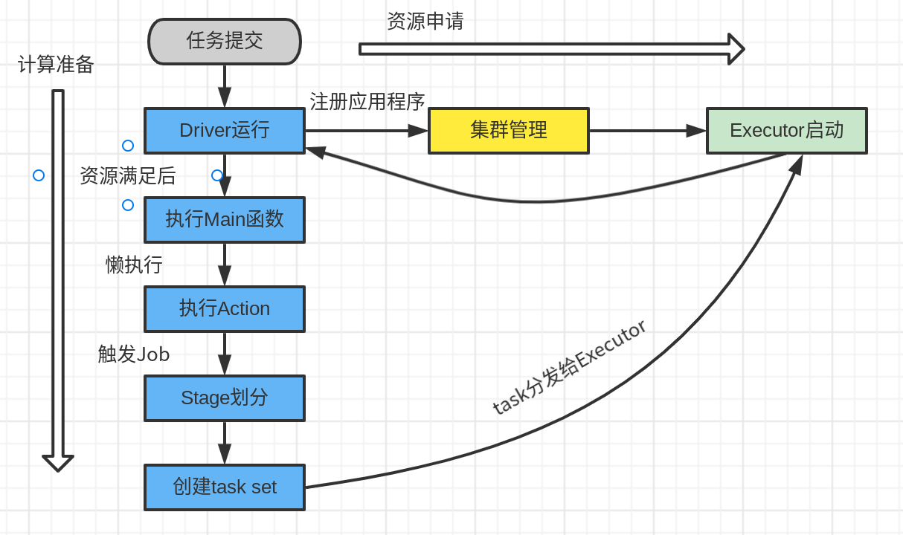

## spark run
### spark核心组件
* driver(计算) 
* executor(计算)
* master(resource manage 资源)
* worker(node manage 资源)
* application master(解耦资源和计算)
### spark核心概念
* Executor(一个JVM进程)
  * num executors(executor数量)
  * executors memory(单个executor内存)
  * executors cores(单个executors cpu核心数)
* DAG
  * 作用(调度)
* Yarn flow  

* Yarn 运行模式(Driver运行节点位置不同)
  * client
  * cluster
## spark core coding
### data struct
* rdd
* accumulator
* broadcast
### RDD
